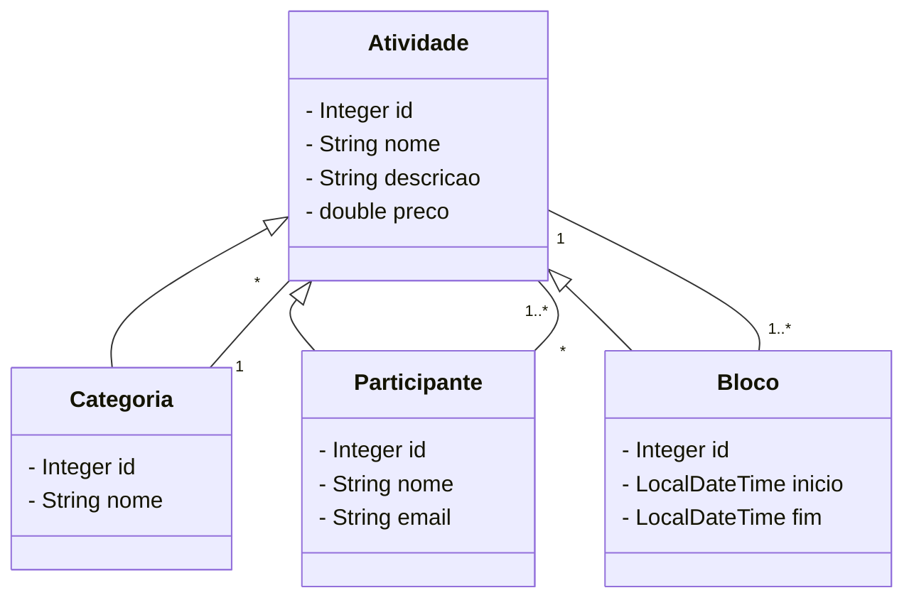

# Sistema de Gerenciamento de Atividades de um Evento Acadêmico

Este é um projeto desenvolvido em Java utilizando Spring Boot e Java 17, com o Maven como gerenciador de dependências. O sistema é utilizado para gerenciar as informações dos participantes das atividades de um evento acadêmico, como palestras, cursos, oficinas práticas, entre outros.

## Dependências

O projeto utiliza as seguintes especificações:
- Java 17
- Spring Boot 3.1.10
- Spring Web
- Spring Data JPA
- H2 Database
- Maven

## Diagrama de Classes

## Execução do Projeto

Para executar o projeto localmente, siga os passos abaixo:

1. Clone este repositório.
2. Importe o projeto em sua IDE preferida.
3. Certifique-se de ter o Java 17 instalado em sua máquina.
4. Configure o ambiente de acordo com as instruções da documentação do Spring Boot.
5. Execute a classe `AtividadesDeUmEventoAcademicoApplication.java`.

## Contribuição

Contribuições são bem-vindas! Sinta-se à vontade para abrir uma issue ou enviar um pull request.

